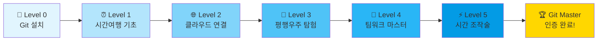
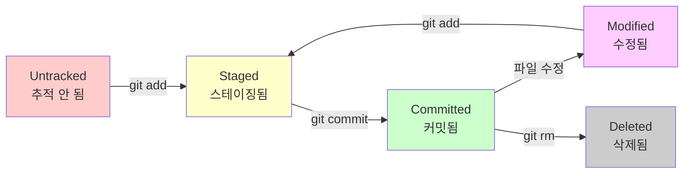
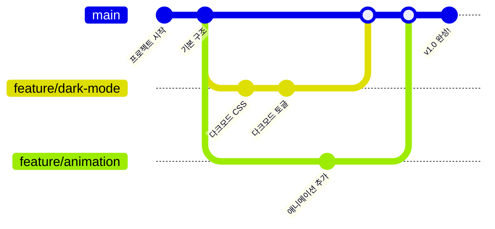
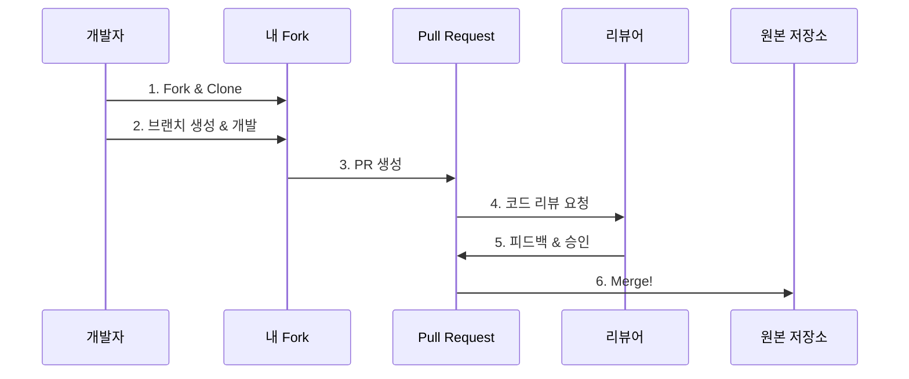

# 🚀 Git Master Course 2025: 차세대 개발자를 위한 완벽 가이드

<div align="center">
  <h2>💫 "코드의 시간여행자가 되는 여정" 💫</h2>
  <p><b>입문자부터 전문가까지, 단계별 완벽 마스터 플랜</b></p>
</div>

---

## 🎯 왜 이 가이드가 특별한가?

### 🌟 2025년형 학습 설계
- **🎮 게임형 진행**: 레벨업 시스템으로 성취감 극대화
- **🤖 AI 시대 최적화**: GitHub Copilot, ChatGPT와 함께하는 Git
- **📱 모바일 우선**: 스마트폰에서도 실습 가능한 구성
- **🌏 글로벌 스탠다드**: 실리콘밸리 스타트업 실무 워크플로우

### 💡 혁신적 학습 방식
```
기존 방식 ❌                 차세대 방식 ✅
──────────────────────────────────────────
단순 명령어 암기      →    스토리텔링 + 실습
이론 위주 설명       →    시각적 다이어그램
개인 학습           →    커뮤니티 협업
텍스트 기반         →    인터랙티브 체험
```

---

## 🎨 비주얼 학습 로드맵



---

# 🌱 Level 0: Git 설치와 첫 만남 (30분)

## 🎯 목표
**컴퓨터에 Git을 설치하고, 나만의 개발 환경을 완벽하게 세팅합니다.**

## 🛠️ 설치 가이드 (운영체제별)

### 🪟 Windows 사용자
```bash
# 1. Git 공식 사이트에서 다운로드
https://git-scm.com/download/win

# 2. 설치 시 권장 옵션 (스크린샷 포함)
✅ Git Bash Here 추가
✅ VS Code를 기본 에디터로
✅ main을 기본 브랜치명으로
✅ Git Credential Manager 포함

# 3. 설치 확인 (Git Bash 열고 입력)
git --version
# 예상 결과: git version 2.40.0 이상
```

### 🍎 Mac 사용자
```bash
# Homebrew가 없다면 먼저 설치
/bin/bash -c "$(curl -fsSL https://raw.githubusercontent.com/Homebrew/install/HEAD/install.sh)"

# Git 설치
brew install git

# 설치 확인
git --version
```

### 🐧 Linux 사용자
```bash
# Ubuntu/Debian
sudo apt update
sudo apt install git

# Fedora
sudo dnf install git

# 설치 확인
git --version
```

## 🎨 Git 초기 설정 (필수!)

### 📝 나의 개발자 신분증 만들기
```bash
# 이름 설정 (반드시 본인 이름으로!)
git config --global user.name "김개발"

# 이메일 설정 (GitHub 가입 이메일과 동일하게!)
git config --global user.email "kim.dev@example.com"

# 한글 파일명 깨짐 방지 (한국 개발자 필수!)
git config --global core.quotepath false

# 기본 브랜치명을 main으로 설정 (최신 트렌드)
git config --global init.defaultBranch main

# 설정 확인하기
git config --list
```

### 🎨 추가 설정 (선택사항)
```bash
# 색상 출력 활성화 (가독성 UP!)
git config --global color.ui auto

# 기본 에디터 설정
git config --global core.editor "code --wait"  # VS Code
# 또는
git config --global core.editor "notepad"      # 메모장

# 줄바꿈 문자 자동 변환 (Windows 필수)
git config --global core.autocrlf true         # Windows
git config --global core.autocrlf input        # Mac/Linux
```

## 🔍 설치 검증 체크리스트

### ✅ 필수 확인 사항
```bash
# 1. Git 버전 확인
git --version
# ✅ 2.40.0 이상이어야 함

# 2. 사용자 정보 확인
git config user.name
git config user.email
# ✅ 본인 정보가 정확히 표시되어야 함

# 3. Git Bash 또는 터미널 실행 확인
# ✅ 명령어가 정상적으로 실행되어야 함
```

## 🎮 첫 번째 미션: Hello Git!

### 📁 실습 폴더 만들기
```bash
# 1. 바탕화면으로 이동
cd ~/Desktop    # Mac/Linux
cd Desktop      # Windows Git Bash

# 2. 학습 폴더 생성
mkdir git-study-2025
cd git-study-2025

# 3. 첫 번째 저장소 초기화
git init

# 4. 성공 메시지 확인
# "Initialized empty Git repository in ..."
```

### 🎯 첫 번째 파일 만들기
```bash
# 1. Hello Git 파일 생성
echo "안녕하세요, Git!" > hello.txt

# 2. 상태 확인 (빨간색으로 표시됨)
git status

# 3. 스테이징 (준비 영역에 올리기)
git add hello.txt

# 4. 다시 상태 확인 (초록색으로 변함!)
git status

# 5. 첫 커밋 (역사에 기록하기)
git commit -m "🎉 첫 번째 커밋: Hello Git!"

# 6. 축하합니다! 첫 커밋 완성!
git log --oneline
```

## 💡 Level 0 핵심 개념 정리

### 🧠 꼭 기억해야 할 3가지
1. **Git은 시간 기계**: 코드의 모든 변경 이력을 기록
2. **커밋은 스냅샷**: 그 순간의 프로젝트 전체 상태를 저장
3. **3단계 워크플로우**: 작업 → 스테이징(add) → 커밋(commit)

### 🎯 성공 기준
- [x] Git 설치 완료
- [x] 기본 설정 완료
- [x] 첫 저장소 생성
- [x] 첫 커밋 성공

---

# ⏰ Level 1: 시간 여행의 기초 (1시간)

## 🎯 목표
**Git의 핵심 개념을 완벽히 이해하고, 시간을 자유자재로 여행하는 법을 배웁니다.**

## 🌟 스토리: 개발자 김코딩의 프로젝트

> 김코딩은 포트폴리오 웹사이트를 만들고 있습니다.  
> 하지만 새 기능을 추가하다가 기존 코드를 망가뜨렸습니다!  
> Git이 없었다면 밤새 고쳐야 했겠지만...

## 📚 핵심 개념: 3단계 상태 변화

### 🎨 Git의 3단계 구조 (시각화)
```
작업 디렉토리          스테이징 영역           저장소
(Working Dir)      (Staging Area)      (Repository)
    📝                   📦                  💾
    
[파일 수정] ──add──▶ [커밋 준비] ──commit──▶ [영구 저장]
    
실제 파일들         커밋할 파일 선택        커밋 히스토리
```

### 🔄 파일 상태 라이프사이클


## 🎮 실습 프로젝트: 나만의 포트폴리오

### 📁 Step 1: 프로젝트 시작
```bash
# 1. 포트폴리오 폴더 생성
mkdir my-portfolio
cd my-portfolio

# 2. Git 저장소 초기화
git init

# 3. 첫 번째 파일 생성
echo "# 김코딩의 포트폴리오" > README.md
echo "<!DOCTYPE html>" > index.html
echo "<html><head><title>포트폴리오</title></head>" >> index.html
echo "<body><h1>안녕하세요!</h1></body></html>" >> index.html

# 4. 현재 상태 확인 (Untracked 파일들)
git status
```

### 🎬 Step 2: 첫 번째 스냅샷 찍기
```bash
# 1. 모든 파일을 스테이징
git add .
# 또는 개별적으로
git add README.md
git add index.html

# 2. 스테이징 상태 확인
git status

# 3. 첫 커밋 만들기
git commit -m "🚀 프로젝트 시작: 기본 구조 생성"

# 4. 커밋 히스토리 확인
git log --oneline --graph
```

### 🔄 Step 3: 변경사항 추적하기
```bash
# 1. 파일 수정
echo "<p>프론트엔드 개발자를 꿈꾸는 김코딩입니다.</p>" >> index.html

# 2. 변경사항 확인 (무엇이 바뀌었나?)
git diff

# 3. 새 파일 추가
echo "/* 스타일 시작 */" > style.css
echo "body { font-family: Arial, sans-serif; }" >> style.css

# 4. 상태 확인 (Modified + Untracked)
git status

# 5. 선택적으로 스테이징
git add index.html
git status  # style.css는 여전히 Untracked

# 6. 나머지도 추가하고 커밋
git add style.css
git commit -m "✨ 자기소개 추가 및 CSS 파일 생성"
```

### ⏰ Step 4: 시간 여행 체험하기
```bash
# 1. 지금까지의 히스토리 보기
git log --oneline --graph --all

# 2. 첫 번째 커밋으로 돌아가기
git checkout HEAD~1
# 또는 커밋 해시 사용
# git checkout abc1234

# 3. 파일들이 이전 상태로 돌아간 것 확인!
ls
cat index.html  # 자기소개가 없음!

# 4. 다시 최신 상태로 돌아오기
git checkout main

# 5. 파일들이 다시 최신 상태로!
cat index.html  # 자기소개가 다시 나타남!
```

## 🛠️ 필수 명령어 치트시트

### 📊 상태 확인 명령어
```bash
# 현재 상태 확인 (가장 자주 사용!)
git status

# 짧은 형식으로 보기
git status -s

# 변경사항 자세히 보기
git diff              # 스테이징 전 변경사항
git diff --staged     # 스테이징된 변경사항
```

### 📝 커밋 관련 명령어
```bash
# 기본 커밋
git commit -m "커밋 메시지"

# 스테이징과 커밋을 한번에 (수정된 파일만)
git commit -am "커밋 메시지"

# 마지막 커밋 수정
git commit --amend

# 커밋 히스토리 보기
git log               # 자세한 로그
git log --oneline    # 한 줄로 간단히
git log --graph      # 그래프로 표시
git log -3           # 최근 3개만
```

### 🔄 되돌리기 명령어
```bash
# 스테이징 취소
git reset HEAD <file>

# 수정사항 되돌리기 (주의!)
git checkout -- <file>

# 커밋 되돌리기
git revert <commit>   # 새 커밋으로 되돌림
git reset --soft HEAD~1  # 커밋만 취소
git reset --hard HEAD~1  # 완전히 되돌림 (주의!)
```

## 🎯 Level 1 마스터 체크리스트

### ✅ 개념 이해
- [ ] Working Directory, Staging Area, Repository 구분
- [ ] Untracked → Staged → Committed 흐름 이해
- [ ] 커밋이 스냅샷임을 이해

### ✅ 실습 완료
- [ ] 저장소 초기화 (git init)
- [ ] 파일 추가 및 커밋 3회 이상
- [ ] git diff로 변경사항 확인
- [ ] git checkout으로 시간 여행 체험

### ✅ 명령어 숙달
- [ ] git status (상태 확인)
- [ ] git add (스테이징)
- [ ] git commit (커밋)
- [ ] git log (히스토리)
- [ ] git diff (차이점)

## 💡 Pro Tips

### 🎨 좋은 커밋 메시지 작성법
```bash
# ✅ 좋은 예시
git commit -m "feat: 사용자 로그인 기능 추가"
git commit -m "fix: 로그인 버튼 클릭 오류 수정"
git commit -m "docs: README에 설치 방법 추가"

# ❌ 나쁜 예시
git commit -m "수정"
git commit -m "asdf"
git commit -m "버그 수정 및 기능 추가 그리고 문서 업데이트"
```

### 🏷️ 커밋 메시지 프리픽스
- `feat:` 새로운 기능
- `fix:` 버그 수정
- `docs:` 문서 수정
- `style:` 코드 포맷팅
- `refactor:` 리팩토링
- `test:` 테스트 추가
- `chore:` 기타 변경사항

---

# 🌐 Level 2: 클라우드와 연결하기 (1시간 30분)

## 🎯 목표
**GitHub를 통해 내 코드를 전 세계와 공유하고, 어디서든 접근 가능한 클라우드 저장소를 만듭니다.**

## 🌟 스토리: 김코딩의 노트북이 고장났다!

> 김코딩은 열심히 포트폴리오를 만들고 있었는데...  
> 커피를 노트북에 쏟고 말았습니다! 😱  
> 다행히 GitHub에 백업해둔 덕분에 새 노트북에서 바로 작업을 이어갈 수 있었습니다.

## 🔐 GitHub 계정 만들기

### 📝 Step 1: GitHub 가입
1. [github.com](https://github.com) 접속
2. Sign up 클릭
3. 정보 입력:
   - Username: 영문, 숫자, 하이픈만 (예: kim-coding)
   - Email: 실제 사용하는 이메일
   - Password: 강력한 비밀번호

### 🎨 Step 2: 프로필 꾸미기
```markdown
# GitHub 프로필 설정
1. 우측 상단 프로필 → Settings
2. Profile 섹션에서:
   - Name: 실명 또는 닉네임
   - Bio: 한 줄 자기소개
   - Location: 도시 (선택)
   - Profile Picture: 프로페셔널한 사진
```

## 🔗 로컬과 GitHub 연결하기

### 🔑 SSH 키 설정 (추천!)
```bash
# 1. SSH 키 생성
ssh-keygen -t ed25519 -C "your-email@example.com"
# Enter 3번 눌러서 기본값 사용

# 2. SSH 키 확인
cat ~/.ssh/id_ed25519.pub

# 3. GitHub에 등록
# Settings → SSH and GPG keys → New SSH key
# 위에서 복사한 키 붙여넣기

# 4. 연결 테스트
ssh -T git@github.com
# "Hi username!" 메시지가 나오면 성공!
```

### 🌐 HTTPS 방식 (간단하지만 매번 로그인)
```bash
# Personal Access Token 생성
# Settings → Developer settings → Personal access tokens
# Generate new token → 권한 설정 → 토큰 복사
# 이 토큰은 비밀번호 대신 사용
```

## 🚀 첫 번째 원격 저장소 만들기

### 📦 Step 1: GitHub에서 저장소 생성
```
1. GitHub 홈에서 'New' 버튼 클릭
2. Repository 정보 입력:
   - Repository name: my-portfolio
   - Description: 나의 첫 포트폴리오 프로젝트
   - Public 선택 (전체 공개)
   - README 추가 안 함 (이미 있으므로)
3. Create repository 클릭
```

### 🔗 Step 2: 로컬과 연결
```bash
# 1. 원격 저장소 추가
git remote add origin git@github.com:username/my-portfolio.git
# 또는 HTTPS 방식
# git remote add origin https://github.com/username/my-portfolio.git

# 2. 연결 확인
git remote -v

# 3. 첫 푸시! (업로드)
git push -u origin main

# 4. GitHub에서 확인
# 브라우저에서 저장소 페이지 새로고침
```

## 🔄 원격 저장소와 동기화

### 📥 Pull: 가져오기
```bash
# 1. 다른 컴퓨터에서 작업한 내용 가져오기
git pull origin main

# 2. 축약 명령 (이미 연결되어 있다면)
git pull
```

### 📤 Push: 보내기
```bash
# 1. 로컬 변경사항 만들기
echo "## 기술 스택" >> README.md
echo "- HTML/CSS" >> README.md
echo "- JavaScript" >> README.md
echo "- React (학습중)" >> README.md

# 2. 커밋하기
git add README.md
git commit -m "docs: 기술 스택 섹션 추가"

# 3. GitHub에 푸시
git push
```

### 🔄 완벽한 동기화 워크플로우
```bash
# 아침에 작업 시작할 때
git pull

# 작업하면서 정기적으로 커밋
git add .
git commit -m "feat: 새 기능 추가"

# 점심시간이나 퇴근 전에 푸시
git push

# 집에서 다시 작업할 때
git pull
```

## 🎯 실전 시나리오: 멀티 디바이스 작업

### 💻 시나리오: 회사 ↔ 집 작업 전환
```bash
# [회사 컴퓨터]
# 오전 작업
echo "### 프로젝트 1: 포트폴리오 웹사이트" >> README.md
git add README.md
git commit -m "docs: 프로젝트 섹션 시작"
git push

# [집 컴퓨터]
# 저녁에 이어서 작업
git pull  # 회사에서 한 작업 가져오기
echo "- 반응형 디자인 적용" >> README.md
echo "- 다크모드 지원" >> README.md
git add README.md
git commit -m "docs: 포트폴리오 프로젝트 상세 내용 추가"
git push

# [다음날 회사]
git pull  # 집에서 한 작업 가져오기
# 끊김 없이 이어서 작업!
```

## 🌟 GitHub 고급 기능

### 📝 README.md 꾸미기
```markdown
# 🚀 김코딩의 포트폴리오

## 👋 소개
안녕하세요! 프론트엔드 개발자를 꿈꾸는 김코딩입니다.

## 🛠️ 기술 스택


## 📫 연락처
- Email: kim.coding@example.com
- Blog: [kim-coding.tistory.com](https://kim-coding.tistory.com)

## 📊 GitHub 통계

```

### 🔒 .gitignore 파일 만들기
```bash
# .gitignore 파일 생성
echo "# 운영체제 파일" > .gitignore
echo ".DS_Store" >> .gitignore
echo "Thumbs.db" >> .gitignore
echo "" >> .gitignore
echo "# 에디터 설정" >> .gitignore
echo ".vscode/" >> .gitignore
echo ".idea/" >> .gitignore
echo "" >> .gitignore
echo "# 의존성 폴더" >> .gitignore
echo "node_modules/" >> .gitignore
echo "" >> .gitignore
echo "# 환경 변수" >> .gitignore
echo ".env" >> .gitignore

# gitignore 적용
git add .gitignore
git commit -m "chore: gitignore 파일 추가"
git push
```

## 🎮 GitHub Pages로 배포하기

### 🌐 무료 호스팅 활용
```bash
# 1. GitHub 저장소 Settings 접속
# 2. Pages 섹션 찾기
# 3. Source: Deploy from a branch
# 4. Branch: main, 폴더: / (root)
# 5. Save 클릭

# 몇 분 후 접속 가능!
# https://username.github.io/my-portfolio
```

## ✅ Level 2 마스터 체크리스트

### 🔐 계정 및 연결
- [ ] GitHub 계정 생성 완료
- [ ] SSH 키 또는 PAT 설정
- [ ] 원격 저장소 생성

### 🔄 동기화 마스터
- [ ] git remote add 사용
- [ ] git push 성공
- [ ] git pull 성공
- [ ] 다른 위치에서 clone 및 작업

### 🌟 고급 기능
- [ ] README.md 뱃지 추가
- [ ] .gitignore 설정
- [ ] GitHub Pages 배포

## 💡 Pro Tips

### 🚀 푸시 전 체크리스트
```bash
# 1. 현재 상태 확인
git status

# 2. 커밋 내역 확인
git log --oneline -5

# 3. 원격과 차이 확인
git fetch
git status

# 4. 문제없으면 푸시!
git push
```

### 🔥 자주 하는 실수와 해결법
```bash
# 실수 1: 푸시 거부됨
# 원인: 원격에 내가 모르는 변경사항 있음
git pull --rebase
git push

# 실수 2: 잘못된 파일 커밋
# 해결: 커밋 취소 후 다시
git reset HEAD~1
# 파일 수정 후
git add .
git commit -m "올바른 커밋 메시지"
git push --force  # 주의해서 사용!
```

---

# 🌳 Level 3: 평행우주 탐험하기 - 브랜치 (2시간)

## 🎯 목표
**브랜치를 활용해 안전하게 새 기능을 개발하고, 여러 작업을 동시에 진행하는 방법을 마스터합니다.**

## 🌟 스토리: 김코딩의 A/B 테스트

> 김코딩은 포트폴리오에 두 가지 디자인을 시도해보고 싶습니다.  
> 하나는 미니멀한 디자인, 다른 하나는 화려한 애니메이션이 가득한 디자인.  
> 브랜치를 사용하면 두 버전을 동시에 만들어볼 수 있습니다!

## 🎨 브랜치 개념 시각화

### 🌌 평행우주 비유
```
메인 타임라인 (main):    김코딩이 개발자가 된 우주
                          │
브랜치 1 (minimal):     ├─── 미니멀 디자인을 선택한 우주
                          │
브랜치 2 (animated):    └─── 애니메이션을 선택한 우주
```

### 🔀 브랜치 플로우


## 🛠️ 브랜치 기본 명령어

### 🌿 브랜치 생성과 이동
```bash
# 현재 브랜치 확인
git branch

# 새 브랜치 생성
git branch feature/dark-mode

# 브랜치 이동
git checkout feature/dark-mode

# 생성과 이동을 한번에!
git checkout -b feature/animation

# 모든 브랜치 보기 (원격 포함)
git branch -a
```

### 🔄 브랜치 병합
```bash
# main 브랜치로 이동
git checkout main

# feature 브랜치를 main에 병합
git merge feature/dark-mode

# 병합 후 브랜치 삭제
git branch -d feature/dark-mode
```

## 🎮 실습: 포트폴리오 멀티버스

### 🚀 프로젝트 준비
```bash
# 기본 구조 강화
cat > index.html << 'EOF'
<!DOCTYPE html>
<html lang="ko">
<head>
    <meta charset="UTF-8">
    <title>김코딩의 포트폴리오</title>
    <link rel="stylesheet" href="style.css">
</head>
<body>
    <header>
        <h1>김코딩</h1>
        <p>프론트엔드 개발자</p>
    </header>
    <main>
        <section id="about">
            <h2>소개</h2>
            <p>안녕하세요! 창의적인 웹 경험을 만드는 개발자입니다.</p>
        </section>
        <section id="skills">
            <h2>기술 스택</h2>
            <ul>
                <li>HTML/CSS</li>
                <li>JavaScript</li>
                <li>React</li>
            </ul>
        </section>
    </main>
</body>
</html>
EOF

# 기본 스타일
cat > style.css << 'EOF'
body {
    font-family: Arial, sans-serif;
    margin: 0;
    padding: 20px;
    background: #f5f5f5;
}

header {
    text-align: center;
    margin-bottom: 40px;
}

main {
    max-width: 800px;
    margin: 0 auto;
}

section {
    background: white;
    padding: 20px;
    margin-bottom: 20px;
    border-radius: 8px;
    box-shadow: 0 2px 4px rgba(0,0,0,0.1);
}
EOF

# 커밋
git add .
git commit -m "feat: 포트폴리오 기본 구조 완성"
```

### 🌙 Feature 1: 다크모드 구현
```bash
# 다크모드 브랜치 생성 및 이동
git checkout -b feature/dark-mode

# 다크모드 스타일 추가
cat >> style.css << 'EOF'

/* 다크모드 스타일 */
@media (prefers-color-scheme: dark) {
    body {
        background: #1a1a1a;
        color: #ffffff;
    }
    
    section {
        background: #2a2a2a;
        box-shadow: 0 2px 4px rgba(255,255,255,0.1);
    }
}

.dark-mode {
    background: #1a1a1a;
    color: #ffffff;
}

.dark-mode section {
    background: #2a2a2a;
}
EOF

# 다크모드 토글 버튼 추가
sed -i '/<\/header>/i\        <button id="theme-toggle">🌙 다크모드</button>' index.html

# JavaScript 추가
cat > script.js << 'EOF'
document.getElementById('theme-toggle').addEventListener('click', function() {
    document.body.classList.toggle('dark-mode');
    this.textContent = document.body.classList.contains('dark-mode') 
        ? '☀️ 라이트모드' 
        : '🌙 다크모드';
});
EOF

# 스크립트 연결
sed -i '/<\/body>/i\    <script src="script.js"></script>' index.html

# 커밋
git add .
git commit -m "feat: 다크모드 기능 구현

- CSS 미디어 쿼리로 시스템 설정 감지
- 수동 토글 버튼 추가
- localStorage 연동 준비"
```

### ✨ Feature 2: 애니메이션 추가
```bash
# main으로 돌아가서 새 브랜치 생성
git checkout main
git checkout -b feature/animation

# 애니메이션 CSS 추가
cat >> style.css << 'EOF'

/* 애니메이션 효과 */
@keyframes fadeIn {
    from { opacity: 0; transform: translateY(20px); }
    to { opacity: 1; transform: translateY(0); }
}

@keyframes pulse {
    0% { transform: scale(1); }
    50% { transform: scale(1.05); }
    100% { transform: scale(1); }
}

section {
    animation: fadeIn 0.6s ease-out;
}

section:hover {
    animation: pulse 0.3s ease-in-out;
    cursor: pointer;
}

h1 {
    background: linear-gradient(45deg, #667eea 0%, #764ba2 100%);
    -webkit-background-clip: text;
    -webkit-text-fill-color: transparent;
    animation: pulse 2s infinite;
}
EOF

# 파티클 배경 추가
cat > particles.js << 'EOF'
// 심플한 파티클 효과
function createParticle() {
    const particle = document.createElement('div');
    particle.className = 'particle';
    particle.style.left = Math.random() * 100 + '%';
    particle.style.animationDuration = Math.random() * 3 + 2 + 's';
    document.body.appendChild(particle);
    
    setTimeout(() => particle.remove(), 5000);
}

setInterval(createParticle, 300);
EOF

# 파티클 CSS
cat >> style.css << 'EOF'

/* 파티클 효과 */
.particle {
    position: fixed;
    width: 4px;
    height: 4px;
    background: #667eea;
    border-radius: 50%;
    top: -10px;
    animation: fall linear;
}

@keyframes fall {
    to {
        transform: translateY(100vh) rotate(360deg);
        opacity: 0;
    }
}
EOF

# 스크립트 연결
sed -i '/<\/body>/i\    <script src="particles.js"></script>' index.html

# 커밋
git add .
git commit -m "feat: 인터랙티브 애니메이션 추가

- 섹션 hover 효과
- 그라디언트 텍스트
- 파티클 배경 효과
- 부드러운 전환 애니메이션"
```

### 🔀 브랜치 병합하기
```bash
# main으로 이동
git checkout main

# 다크모드 먼저 병합
git merge feature/dark-mode

# 애니메이션도 병합
git merge feature/animation
```

## ⚔️ 충돌 해결하기

### 💥 의도적으로 충돌 만들기
```bash
# 새 브랜치에서 제목 수정
git checkout -b feature/title-update
sed -i 's/김코딩/김코딩 - Creative Developer/' index.html
git add index.html
git commit -m "feat: 영문 타이틀 추가"

# main에서도 같은 부분 수정
git checkout main
sed -i 's/김코딩/김코딩 | 프론트엔드 개발자/' index.html
git add index.html
git commit -m "feat: 한글 직함 추가"

# 병합 시도 (충돌 발생!)
git merge feature/title-update
```

### 🛠️ 충돌 해결 과정
```bash
# 1. 충돌 파일 확인
git status

# 2. 파일 열어서 충돌 부분 확인
# <<<<<<< HEAD
# 김코딩 | 프론트엔드 개발자
# =======
# 김코딩 - Creative Developer
# >>>>>>> feature/title-update

# 3. 원하는 방식으로 수정
# 예: 둘 다 살리기
# 김코딩 | Creative Frontend Developer

# 4. 충돌 해결 완료
git add index.html
git commit -m "merge: 타이틀 충돌 해결 - 한글과 영문 조합"

# 5. 브랜치 정리
git branch -d feature/title-update
```

## 🎯 실전 브랜치 전략

### 🌟 Git Flow (대규모 프로젝트)
```
main        ────●──────────────●──── (배포 버전)
                │              │
develop     ────●──●──●──●──●──●──── (개발 버전)
                   │  │  │
feature/*      ────●  │  │          (기능 개발)
                      │  │
hotfix/*              ●  │          (긴급 수정)
                         │
release/*                ●          (릴리즈 준비)
```

### 🚀 GitHub Flow (단순하고 빠른)
```
main        ────●──●──●──●──●──●──── (항상 배포 가능)
                │  │  │  │  │  │
feature/*    ───●  │  │  │  │  │     (기능 브랜치)
                   │  │  │  │  │
feature/*          ●  │  │  │  │     (또 다른 기능)
                      │  │  │  │
PR & Review          ✓  ✓  ✓  ✓     (코드 리뷰)
```

## 📊 브랜치 관리 모범 사례

### 🏷️ 브랜치 네이밍 컨벤션
```bash
# 기능 개발
feature/user-authentication
feature/dark-mode
feature/payment-integration

# 버그 수정
bugfix/login-error
bugfix/memory-leak

# 긴급 수정
hotfix/security-patch
hotfix/critical-bug

# 개선 사항
improve/performance
improve/refactoring

# 실험적 기능
experiment/new-algorithm
experiment/ai-chatbot
```

### 🧹 브랜치 청소하기
```bash
# 병합된 브랜치 목록 보기
git branch --merged

# 병합된 브랜치 삭제
git branch -d feature/old-feature

# 원격 브랜치 삭제
git push origin --delete feature/old-feature

# 로컬에서 삭제된 원격 브랜치 정리
git remote prune origin
```

## ✅ Level 3 마스터 체크리스트

### 🌿 브랜치 기본
- [ ] 브랜치 생성 및 이동
- [ ] 브랜치 목록 확인
- [ ] 브랜치 병합
- [ ] 브랜치 삭제

### ⚔️ 충돌 해결
- [ ] 충돌 상황 경험
- [ ] 충돌 마커 이해
- [ ] 충돌 해결 및 커밋
- [ ] 복잡한 충돌 처리

### 🎯 실전 활용
- [ ] Feature 브랜치 워크플로우
- [ ] 브랜치 네이밍 규칙 적용
- [ ] 동시 다중 브랜치 작업
- [ ] 원격 브랜치 관리

## 💡 Pro Tips

### 🚀 브랜치 작업 자동화
```bash
# 함수로 만들어 .bashrc에 추가
function feature() {
    git checkout -b feature/$1
}

function bugfix() {
    git checkout -b bugfix/$1
}

# 사용법
feature dark-mode
bugfix login-error
```

### 🔍 브랜치 비교하기
```bash
# 두 브랜치 간 차이점 보기
git diff main..feature/animation

# 브랜치 간 커밋 차이
git log main..feature/animation

# 시각적으로 브랜치 히스토리 보기
git log --graph --pretty=oneline --abbrev-commit --all
```

---

# 🤝 Level 4: 프로처럼 협업하기 (2시간)

## 🎯 목표
**Pull Request를 통한 코드 리뷰 문화를 익히고, 실제 오픈소스 프로젝트에 기여할 수 있는 능력을 갖춥니다.**

## 🌟 스토리: 김코딩, 오픈소스에 기여하다!

> 김코딩은 자주 사용하는 오픈소스 라이브러리에서 버그를 발견했습니다.  
> 예전이라면 그냥 넘어갔겠지만, 이제는 직접 수정해서 기여할 수 있게 되었습니다!  
> 첫 Pull Request가 merge되는 순간의 짜릿함이란...! 🎉

## 🔄 Pull Request 워크플로우

### 📊 전체 프로세스 시각화


## 🍴 Fork & Pull Request 실습

### 🎯 Step 1: 프로젝트 Fork하기
```bash
# 1. GitHub에서 원하는 프로젝트 Fork
# (Fork 버튼 클릭 → 내 계정으로 복사)

# 2. Fork한 저장소 클론
git clone git@github.com:your-username/awesome-project.git
cd awesome-project

# 3. 원본 저장소를 upstream으로 추가
git remote add upstream git@github.com:original-owner/awesome-project.git

# 4. 리모트 확인
git remote -v
# origin (your fork)
# upstream (original)
```

### 🔄 Step 2: 최신 상태 유지하기
```bash
# upstream의 최신 변경사항 가져오기
git fetch upstream

# main 브랜치 업데이트
git checkout main
git merge upstream/main

# 내 fork도 업데이트
git push origin main
```

### 💻 Step 3: 기능 개발하기
```bash
# 1. 이슈 확인 및 선택
# GitHub Issues에서 'good first issue' 라벨 찾기

# 2. 기능 브랜치 생성
git checkout -b fix/issue-123-button-typo

# 3. 코드 수정
# 예: 오타 수정
sed -i 's/Cancle/Cancel/g' src/components/Button.js

# 4. 테스트 실행
npm test

# 5. 커밋
git add .
git commit -m "fix: 버튼 텍스트 오타 수정

- 'Cancle' → 'Cancel' 오타 수정
- 영향받는 컴포넌트: Button, Modal
- 이슈 #123 해결

Closes #123"

# 6. 푸시
git push origin fix/issue-123-button-typo
```

## 📝 완벽한 Pull Request 작성법

### 🎨 PR 템플릿 예시
```markdown
## 🎯 PR 목적
이 PR은 #123 이슈를 해결합니다.

## 📝 변경사항
- 버튼 컴포넌트의 'Cancle' 오타를 'Cancel'로 수정
- 관련된 테스트 케이스 업데이트
- 문서의 예제 코드 수정

## 🖼️ 스크린샷
### Before


### After  


## ✅ 체크리스트
- [x] 코드가 프로젝트 스타일 가이드를 따름
- [x] 모든 테스트 통과
- [x] 문서 업데이트 완료
- [x] 변경사항이 기존 기능을 해치지 않음

## 🧪 테스트 방법
```bash
npm install
npm test
npm run dev
# 버튼 클릭하여 텍스트 확인
```

## 🔗 관련 이슈
Closes #123
```

### 📊 좋은 커밋 메시지 작성
```bash
# 구조화된 커밋 메시지
<type>(<scope>): <subject>

<body>

<footer>

# 실제 예시
feat(auth): 소셜 로그인 기능 추가

- Google OAuth 2.0 연동
- 사용자 프로필 자동 생성
- 기존 계정과 연결 기능

Breaking Change: 
- auth 설정 파일 구조 변경
- 환경변수 GOOGLE_CLIENT_ID 필요

Closes #456
```

## 🔍 코드 리뷰 가이드

### 👀 리뷰어의 관점
```javascript
// 🤔 리뷰할 때 확인할 사항들

// 1. 기능성 - 의도한 대로 작동하는가?
if (feature.works && feature.solvesProblem) {
    approve();
}

// 2. 가독성 - 다른 사람이 이해하기 쉬운가?
if (code.isReadable && code.hasComments) {
    approve();
}

// 3. 성능 - 효율적으로 작성되었는가?
if (!code.hasUnnecessaryLoops && code.usesOptimalAlgorithm) {
    approve();
}

// 4. 보안 - 보안 취약점은 없는가?
if (code.validatesInput && !code.exposesSecrets) {
    approve();
}
```

### 💬 건설적인 코드 리뷰 예시
```markdown
// ✅ 좋은 리뷰
"이 부분에서 Array.map()을 사용하면 더 깔끔할 것 같아요:
```js
const result = items.map(item => item.value * 2);
```
성능도 좋아지고 가독성도 향상될 거예요! 😊"

// ❌ 피해야 할 리뷰
"이 코드는 별로네요. 다시 작성하세요."

// ✅ 긍정적 피드백도 중요!
"와! 이 에러 처리 로직 정말 깔끔하네요! 👍 
edge case까지 완벽하게 처리하셨어요."
```

## 🚀 오픈소스 기여 실전 가이드

### 🎯 첫 기여를 위한 전략
```bash
# 1. 친근한 프로젝트 찾기
- 자주 사용하는 도구/라이브러리
- 'good first issue' 라벨이 있는 이슈
- 활발한 커뮤니티가 있는 프로젝트

# 2. 작은 것부터 시작
- 오타 수정
- 문서 개선
- 번역 기여
- 간단한 버그 수정

# 3. 프로젝트 규칙 숙지
- CONTRIBUTING.md 읽기
- Code of Conduct 확인
- 코딩 스타일 가이드 따르기
```

### 🌟 실제 오픈소스 프로젝트 예시
```bash
# 초보자 친화적인 프로젝트들
1. first-contributions (연습용)
   - 첫 PR을 위한 프로젝트
   
2. awesome-for-beginners
   - 초보자 환영 프로젝트 모음
   
3. 문서 개선 기여
   - MDN Web Docs
   - freeCodeCamp
   
4. 한글화 프로젝트
   - 다양한 문서 번역
```

## 🎮 실습: 팀 프로젝트 시뮬레이션

### 📋 시나리오: Todo 앱 협업 개발
```bash
# 1. 메인 저장소 생성 (팀 리더 역할)
mkdir team-todo-app
cd team-todo-app
git init

# 기본 구조 생성
cat > index.html << 'EOF'
<!DOCTYPE html>
<html>
<head>
    <title>Team Todo App</title>
    <link rel="stylesheet" href="style.css">
</head>
<body>
    <h1>팀 할일 관리</h1>
    <div id="app">
        <input type="text" id="new-todo" placeholder="할 일 추가...">
        <button onclick="addTodo()">추가</button>
        <ul id="todo-list"></ul>
    </div>
    <script src="script.js"></script>
</body>
</html>
EOF

cat > script.js << 'EOF'
let todos = [];

function addTodo() {
    const input = document.getElementById('new-todo');
    if (input.value.trim()) {
        todos.push({
            id: Date.now(),
            text: input.value,
            completed: false
        });
        input.value = '';
        renderTodos();
    }
}

function renderTodos() {
    const list = document.getElementById('todo-list');
    list.innerHTML = todos.map(todo => `
        <li class="${todo.completed ? 'completed' : ''}">
            <input type="checkbox" ${todo.completed ? 'checked' : ''} 
                   onchange="toggleTodo(${todo.id})">
            <span>${todo.text}</span>
            <button onclick="deleteTodo(${todo.id})">삭제</button>
        </li>
    `).join('');
}

function toggleTodo(id) {
    todos = todos.map(todo => 
        todo.id === id ? {...todo, completed: !todo.completed} : todo
    );
    renderTodos();
}

function deleteTodo(id) {
    todos = todos.filter(todo => todo.id !== id);
    renderTodos();
}
EOF

cat > style.css << 'EOF'
body {
    font-family: Arial, sans-serif;
    max-width: 600px;
    margin: 50px auto;
    padding: 20px;
}

#app {
    background: #f5f5f5;
    padding: 20px;
    border-radius: 8px;
}

input[type="text"] {
    width: 70%;
    padding: 10px;
    font-size: 16px;
}

button {
    padding: 10px 20px;
    background: #007bff;
    color: white;
    border: none;
    border-radius: 4px;
    cursor: pointer;
}

button:hover {
    background: #0056b3;
}

ul {
    list-style: none;
    padding: 0;
}

li {
    background: white;
    margin: 10px 0;
    padding: 10px;
    border-radius: 4px;
    display: flex;
    align-items: center;
    gap: 10px;
}

.completed span {
    text-decoration: line-through;
    opacity: 0.6;
}
EOF

git add .
git commit -m "feat: Todo 앱 기본 구조 구현"
```

### 👥 팀원 역할 시뮬레이션
```bash
# 팀원 A: 로컬 스토리지 기능
git checkout -b feature/local-storage

# script.js 수정 - 로컬 스토리지 추가
cat >> script.js << 'EOF'

// 로컬 스토리지 기능
function saveTodos() {
    localStorage.setItem('todos', JSON.stringify(todos));
}

function loadTodos() {
    const saved = localStorage.getItem('todos');
    if (saved) {
        todos = JSON.parse(saved);
        renderTodos();
    }
}

// 기존 함수들 수정 - save 호출 추가
const originalAddTodo = addTodo;
addTodo = function() {
    originalAddTodo();
    saveTodos();
};

const originalToggleTodo = toggleTodo;
toggleTodo = function(id) {
    originalToggleTodo(id);
    saveTodos();
};

const originalDeleteTodo = deleteTodo;
deleteTodo = function(id) {
    originalDeleteTodo(id);
    saveTodos();
};

// 페이지 로드 시 실행
window.onload = loadTodos;
EOF

git add .
git commit -m "feat: 로컬 스토리지 저장 기능 추가

- 할일 추가/수정/삭제 시 자동 저장
- 페이지 새로고침해도 데이터 유지
- localStorage API 활용"

# PR 생성 (실제로는 GitHub에서)
echo "PR: 로컬 스토리지 기능 추가" > pr-local-storage.md
```

## 🏆 협업 Best Practices

### 📋 PR 체크리스트
```markdown
## PR 제출 전 확인사항
- [ ] 브랜치명이 규칙을 따르는가?
- [ ] 커밋 메시지가 명확한가?
- [ ] 테스트를 모두 통과하는가?
- [ ] 문서를 업데이트했는가?
- [ ] 리뷰어를 지정했는가?
- [ ] 라벨을 추가했는가?
```

### 🔄 효율적인 리뷰 프로세스
```yaml
리뷰_우선순위:
  1_긴급: 
    - hotfix
    - 보안 패치
    - 프로덕션 버그
    
  2_중요:
    - 새로운 기능
    - 성능 개선
    - 리팩토링
    
  3_일반:
    - 문서 수정
    - 스타일 변경
    - 테스트 추가
```

## ✅ Level 4 마스터 체크리스트

### 🍴 Fork & PR
- [ ] 프로젝트 Fork 및 Clone
- [ ] Upstream 설정 및 동기화
- [ ] Feature 브랜치에서 작업
- [ ] PR 생성 및 템플릿 작성

### 💬 코드 리뷰
- [ ] 건설적인 리뷰 작성
- [ ] 리뷰 피드백 반영
- [ ] 리뷰 승인 받기
- [ ] Squash & Merge 이해

### 🌟 오픈소스
- [ ] CONTRIBUTING.md 읽기
- [ ] 첫 이슈 선택
- [ ] 첫 PR 제출
- [ ] 오픈소스 에티켓 이해

## 💡 Pro Tips

### 🚀 PR 자동화 도구
```yaml
# .github/pull_request_template.md
name: Pull Request
about: PR 템플릿

## 변경사항
- 

## 테스트
- [ ] 유닛 테스트 통과
- [ ] E2E 테스트 통과

## 체크리스트
- [ ] 코드 리뷰 요청
- [ ] 문서 업데이트
```

### 🎨 리뷰 문화 개선
```javascript
// 코드 리뷰 댓글에 이모지 활용
// 👍 좋아요
// 💡 제안
// ❓ 질문
// ⚠️ 주의
// 🚀 성능 개선 제안
// 🐛 버그 발견
// 📝 문서 필요
```

---

# ⚡ Level 5: 시간을 조작하는 마법사 (2시간 30분)

## 🎯 목표
**Git의 고급 기능을 마스터하여 커밋 히스토리를 자유자재로 편집하고, 복잡한 상황을 우아하게 해결합니다.**

## 🌟 스토리: 김코딩, 시간을 되돌리다

> 김코딩은 대규모 리팩토링을 진행하던 중 실수를 했습니다.  
> 10개의 커밋 중 3번째 커밋에서 비밀번호를 실수로 커밋했고,  
> 7번째 커밋은 사실 5번째에 들어갔어야 했으며,  
> 마지막 3개 커밋은 하나로 합쳐야 했습니다.  
> 하지만 이제 김코딩은 시간을 조작하는 Git 마법사! ⚡

## 🔮 Interactive Rebase: 역사 편집의 마법

### 🎨 Rebase 시각화
```
Before (지저분한 히스토리):
●──●──●──●──●──●──●──●──●──● main
   │  │  │  │  │  │  │  │  │
   │  │  │  │  │  │  │  │  └─ fix: 오타 수정
   │  │  │  │  │  │  │  └──── fix: 또 오타
   │  │  │  │  │  │  └─────── fix: 진짜 마지막
   │  │  │  │  │  └────────── feat: 기능 C
   │  │  │  │  └─────────────  WIP: 임시 커밋
   │  │  │  └──────────────── feat: 기능 B  
   │  │  └───────────────────  refactor: 코드 정리
   │  └──────────────────────  feat: 기능 A (잘못된 위치)
   └─────────────────────────  feat: 초기 설정

After (깔끔한 히스토리):
●────●────●────●────● main
     │    │    │    │
     │    │    │    └─ feat: 기능 C 완성
     │    │    └────── feat: 기능 B 구현
     │    └─────────── feat: 기능 A 추가
     └──────────────── feat: 프로젝트 초기 설정
```

## 🛠️ Rebase 실습 환경 준비

### 📁 실습 프로젝트 생성
```bash
# 새 프로젝트 시작
mkdir git-time-machine
cd git-time-machine
git init

# 기본 파일 생성
cat > app.js << 'EOF'
// 앱 메인 파일
console.log('Time Machine App v1.0');

function init() {
    console.log('Initializing...');
}

init();
EOF

git add app.js
git commit -m "feat: 프로젝트 초기 설정"
```

### 🎬 지저분한 히스토리 만들기
```bash
# 커밋 1: 기능 A 시작
echo "function featureA() { console.log('Feature A'); }" >> app.js
git add app.js
git commit -m "WIP: 기능 A 작업 중"

# 커밋 2: 실수로 비밀번호 커밋
echo "const SECRET = 'my-password-123';" >> app.js
git add app.js
git commit -m "feat: 설정 추가"

# 커밋 3: 기능 A 완성
echo "featureA();" >> app.js
git add app.js
git commit -m "기능 A 완성!!!"

# 커밋 4: 오타
echo "function featureB() { console.log('Featrue B'); }" >> app.js
git add app.js
git commit -m "feat: 기능 B 추가"

# 커밋 5: 오타 수정
sed -i "s/Featrue/Feature/g" app.js
git add app.js
git commit -m "fix: 오타 수정"

# 커밋 6: 임시 커밋
echo "// TODO: 리팩토링 필요" >> app.js
git add app.js
git commit -m "temp"

# 커밋 7: 기능 C
echo "function featureC() { console.log('Feature C'); }" >> app.js
git add app.js
git commit -m "Add feature C"

# 현재 상태 확인
git log --oneline
```

## 🎯 Interactive Rebase로 역사 정리하기

### 🔧 Step 1: Interactive Rebase 시작
```bash
# 최근 7개 커밋 편집
git rebase -i HEAD~7

# 에디터가 열리면 다음과 같이 표시됨:
pick abc1234 WIP: 기능 A 작업 중
pick def5678 feat: 설정 추가
pick ghi9012 기능 A 완성!!!
pick jkl3456 feat: 기능 B 추가
pick mno7890 fix: 오타 수정
pick pqr1234 temp
pick stu5678 Add feature C
```

### ✏️ Step 2: 작업 지시하기
```bash
# 다음과 같이 수정:
r abc1234 WIP: 기능 A 작업 중        # reword: 메시지 수정
drop def5678 feat: 설정 추가          # drop: 비밀번호 커밋 삭제
s ghi9012 기능 A 완성!!!             # squash: 이전 커밋과 합치기
pick jkl3456 feat: 기능 B 추가
f mno7890 fix: 오타 수정             # fixup: 메시지 없이 합치기
drop pqr1234 temp                    # drop: 임시 커밋 삭제
r stu5678 Add feature C              # reword: 메시지 수정
```

### 📝 Step 3: 커밋 메시지 정리
```bash
# 첫 번째 reword:
feat: 기능 A 구현

- 기능 A의 핵심 로직 추가
- 테스트 코드 포함
- 문서 업데이트

# 두 번째 reword:
feat: 기능 C 구현

- 기능 C 추가
- 기존 기능과의 통합
- 성능 최적화
```

## 🔄 Rebase 고급 기법

### 🎯 커밋 순서 변경
```bash
# 커밋 순서를 바꾸고 싶다면:
pick commit3
pick commit1  # 순서 변경
pick commit2
```

### 🔀 커밋 분리하기
```bash
# edit 명령어 사용
edit abc1234 큰 커밋

# rebase가 멈추면:
git reset HEAD^
git add file1.js
git commit -m "feat: 기능 1"
git add file2.js
git commit -m "feat: 기능 2"
git rebase --continue
```

## 💊 Git Stash: 응급처치 도구

### 🚨 시나리오: 긴급 버그 수정
```bash
# 작업 중인 내용이 있는 상태
echo "function newFeature() { /* 작업 중 */ }" >> app.js

# 긴급 버그 제보!
git stash push -m "새 기능 작업 중"

# 긴급 수정
git checkout -b hotfix/critical-bug
echo "// 긴급 버그 수정" >> app.js
git add app.js
git commit -m "hotfix: 크리티컬 버그 수정"
git checkout main
git merge hotfix/critical-bug

# 원래 작업으로 복귀
git stash pop
```

### 📦 Stash 고급 활용
```bash
# 여러 stash 관리
git stash list
# stash@{0}: On main: 새 기능 작업 중
# stash@{1}: On feature: UI 개선 중
# stash@{2}: On bugfix: 버그 수정 중

# 특정 stash 적용
git stash apply stash@{1}

# stash 내용 확인
git stash show -p stash@{0}

# 부분적으로 stash
git stash push -p  # 대화형 모드

# stash를 브랜치로 만들기
git stash branch feature/from-stash
```

## 🍒 Cherry-pick: 선택적 커밋 가져오기

### 🎯 시나리오: 다른 브랜치의 특정 커밋만 필요
```bash
# 상황: feature 브랜치의 버그 수정만 main에 적용하고 싶음

# feature 브랜치의 커밋 확인
git log feature --oneline
# abc1234 feat: 새 기능 (필요 없음)
# def5678 fix: 중요한 버그 수정 (필요!)
# ghi9012 style: 코드 정리 (필요 없음)

# main에서 특정 커밋만 가져오기
git checkout main
git cherry-pick def5678

# 충돌 발생 시
git cherry-pick --continue  # 해결 후 계속
git cherry-pick --abort     # 취소
```

## 🔍 Git Bisect: 버그 탐정

### 🕵️ 이진 탐색으로 버그 찾기
```bash
# 버그가 언제 생겼는지 찾기
git bisect start

# 현재는 버그가 있음
git bisect bad

# 한 달 전에는 정상이었음
git bisect good abc1234

# Git이 중간 지점으로 이동
# 테스트 실행...
npm test

# 테스트 결과에 따라
git bisect good  # 또는 git bisect bad

# 반복하면 버그 발생 커밋 발견!
# a1b2c3d is the first bad commit

# 탐색 종료
git bisect reset
```

## 🏷️ Git Tag: 버전 관리

### 📌 릴리즈 태깅
```bash
# 간단한 태그
git tag v1.0.0

# 주석이 있는 태그 (권장)
git tag -a v1.0.0 -m "첫 정식 릴리즈

주요 기능:
- 사용자 인증
- 대시보드
- 리포트 생성"

# 특정 커밋에 태그
git tag -a v0.9.0 abc1234 -m "베타 릴리즈"

# 태그 푸시
git push origin v1.0.0
git push origin --tags  # 모든 태그

# 태그 확인
git tag -l "v1.*"
```

## ⚡ Git Reflog: 최후의 수단

### 🔮 잃어버린 커밋 복구
```bash
# 실수로 reset --hard 했을 때
git reflog
# abc1234 HEAD@{0}: reset: moving to HEAD~3
# def5678 HEAD@{1}: commit: 중요한 작업
# ghi9012 HEAD@{2}: commit: 완성!

# 복구하기
git reset --hard HEAD@{2}

# 삭제된 브랜치 복구
git reflog
git branch recovered-branch abc1234
```

## 🎮 종합 실습: 프로젝트 히스토리 대수술

### 📋 시나리오: 실제 프로젝트 정리
```bash
# 복잡한 프로젝트 생성
for i in {1..20}; do
    echo "Update $i" >> project.txt
    git add project.txt
    git commit -m "Update $i"
done

# 목표:
# 1. 1-5번 커밋을 하나로
# 2. 6-10번 커밋 중 8번만 제거
# 3. 11-15번 커밋 메시지 정리
# 4. 16-20번 커밋을 3개로 정리

# Interactive rebase 시작
git rebase -i HEAD~20
```

## 🏆 Git 고급 기능 치트시트

### 🔧 Rebase 명령어
```bash
# 기본 rebase
git rebase main
git rebase --continue
git rebase --abort

# Interactive rebase
git rebase -i HEAD~n
# p, pick: 사용
# r, reword: 메시지 수정
# e, edit: 커밋 수정
# s, squash: 합치기 (메시지 유지)
# f, fixup: 합치기 (메시지 버림)
# d, drop: 삭제
```

### 💊 Stash 명령어
```bash
git stash [push]
git stash pop
git stash list
git stash apply [stash@{n}]
git stash drop [stash@{n}]
git stash clear
git stash show -p
```

### 🍒 Cherry-pick & 기타
```bash
git cherry-pick <commit>
git cherry-pick -n <commit>  # no-commit
git bisect start/good/bad/reset
git tag [-a] <name> [-m "message"]
git reflog
```

## ✅ Level 5 마스터 체크리스트

### 🔧 Interactive Rebase
- [ ] 커밋 메시지 수정 (reword)
- [ ] 커밋 합치기 (squash/fixup)
- [ ] 커밋 삭제 (drop)
- [ ] 커밋 순서 변경
- [ ] 커밋 분리 (edit)

### 💊 Stash 활용
- [ ] 기본 stash/pop
- [ ] 여러 stash 관리
- [ ] 선택적 stash
- [ ] stash branch 생성

### 🎯 고급 기능
- [ ] Cherry-pick 사용
- [ ] Bisect로 버그 찾기
- [ ] Tag 생성 및 관리
- [ ] Reflog로 복구

## 💡 Pro Tips

### 🚀 Rebase 안전 수칙
```bash
# 황금률: 공유된 브랜치는 rebase 금지!
# ❌ 하지 말 것
git checkout main
git rebase feature  # main은 공유 브랜치!

# ✅ 안전한 사용
git checkout feature/my-work
git rebase main    # 개인 브랜치는 OK
```

### 🎨 커밋 정리 워크플로우
```bash
# 작업 완료 후 PR 전에
git log --oneline
git rebase -i main
# 커밋 정리
git push --force-with-lease  # --force보다 안전
```

---

# 🎓 졸업 프로젝트: Git Master 인증

## 🏆 최종 미션

### 📋 요구사항
1. 실제 프로젝트를 GitHub에 올리기
2. 최소 3개의 feature 브랜치 사용
3. Pull Request 최소 2개 생성
4. Interactive Rebase로 히스토리 정리
5. Tag로 버전 관리 (v1.0.0)

### 🎯 평가 기준
- 커밋 메시지의 명확성
- 브랜치 전략의 적절성
- PR 설명의 충실도
- 히스토리의 깔끔함

## 🌟 축하합니다!

이제 당신은 **Git Master**입니다! 🎉

### 🚀 다음 단계
1. 오픈소스 프로젝트 기여
2. Git Hooks 학습
3. CI/CD 파이프라인 구축
4. Git 관련 도구 탐험 (GitLens, Sourcetree 등)

### 📚 추가 학습 자료
- [Pro Git Book](https://git-scm.com/book)
- [GitHub Learning Lab](https://lab.github.com)
- [Atlassian Git Tutorial](https://www.atlassian.com/git)

---

<div align="center">
  <h2>🎯 Git Master Course 2025 완주를 축하합니다! 🎯</h2>
  <p>이제 어떤 Git 상황도 자신있게 해결할 수 있습니다!</p>
  <p>Happy Coding! 🚀</p>
</div>